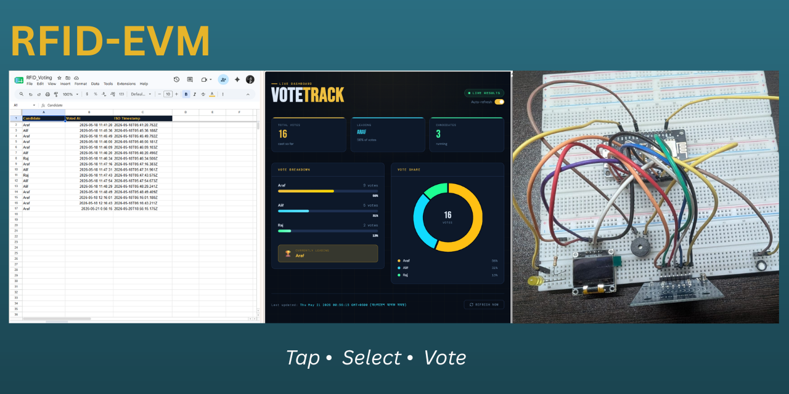
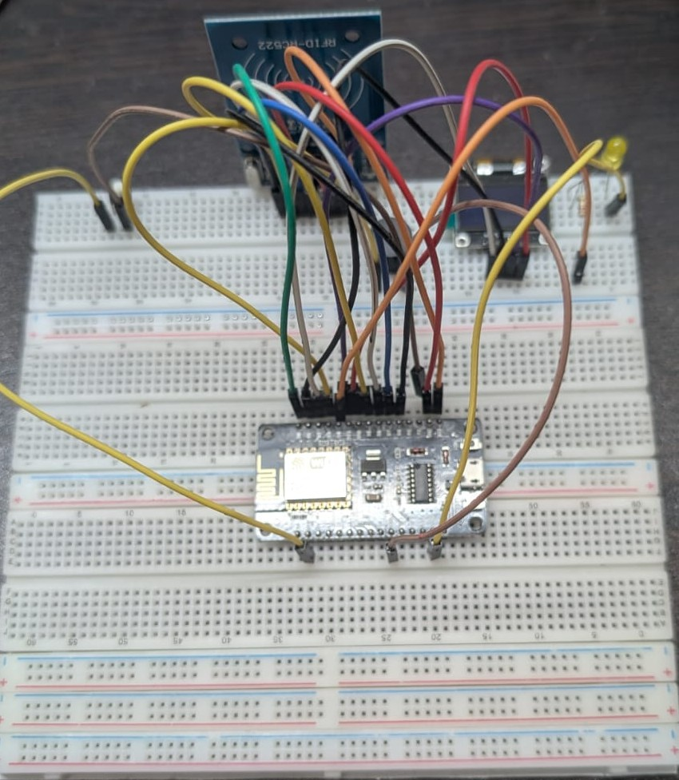
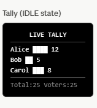
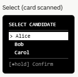
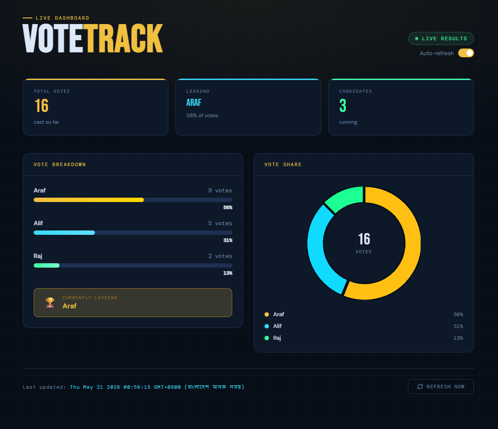
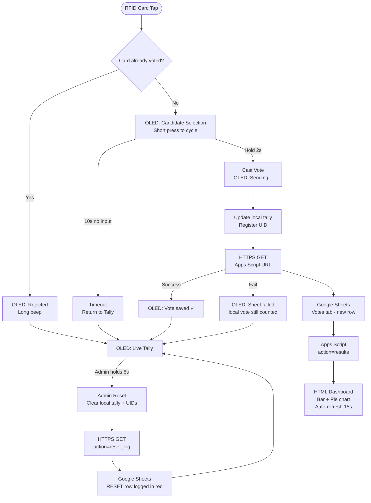

# ⚡ VoteTrack — RFID-Based Electronic Voting Machine

<div align="center">

<!-- Replace YOUR_USERNAME and YOUR_REPO_NAME throughout this file -->



**Tap. Select. Vote. — A 1200Tk voting machine that actually works.**

[](LICENSE)
[](https://www.nodemcu.com/)
[](https://developers.google.com/apps-script)
[](https://www.arduino.cc/)
[]()
[](https://www.aiub.edu/)

</div>

---

## 🗳️ What is RFID-EVM?

RFID-EVM is a low-cost, RFID-based electronic voting machine built as an HCI course project. It strips the voting interaction down to its bare minimum — **tap a card, pick a candidate, hold to confirm.** No touchscreen, no keyboard, no complexity.

Every vote is synced live to Google Sheets and visualised on a real-time web dashboard. The entire hardware build costs under **TK 1200**, yet it covers the core requirements of a real voting system — duplicate prevention, admin reset with audit logging, and live result tracking.

> Built for the **Human Computer Interaction** course at **AIUB**  
> Faculty: **Dr. Muhammad Firoz Mridha**  
> Inspired by: *The Design of Everyday Things* — Don Norman

---

## 📸 Visuals

<div align="center">

| Hardware | OLED — Live Tally | OLED — Vote Selection | Web Dashboard |
|:---:|:---:|:---:|:---:|
|  |  |  |  |

> 📹 **[Watch the full demo video](assets/demo/demo_video.mp4)**

</div>

---

## ✨ Features

- **One-tap voting** — RFID card tap triggers the entire flow
- **Candidate cycling** — short button press cycles through options
- **Hold-to-confirm** — 2s hold with live progress bar on OLED
- **Duplicate prevention** — each card UID allowed one vote only
- **10s timeout** — auto-returns to tally if voter walks away
- **Admin reset** — 5s hold clears votes and logs a timestamped audit row
- **Live Google Sheets sync** — every vote sent over HTTPS after confirmation
- **Real-time dashboard** — bar chart, pie chart, vote percentages, auto-refreshes every 15s
- **Offline resilience** — vote counted locally even if network send fails

---

## 🔧 Hardware

| Component | Quantity | Approx. Cost |
|---|---|---|
| NodeMCU ESP8266 | 1 | ~350 Tk |
| RC522 RFID Reader + Cards | 1 set | ~200 Tk |
| SSD1306 OLED 128x64 (I2C) | 1 | ~350 Tk |
| Passive Buzzer | 1 | ~15 TK |
| LED + 220Ω resistor | 1 | ~5 Tk |
| Push Button | 1 | ~5 Tk |
| Jumper Wires + Breadboard | — | ~260 Tk |
| **Total** | | **1185 TK** |

---

## 🔌 Wiring

| Component | NodeMCU Pin | GPIO |
|---|---|---|
| RC522 SDA | D8 | GPIO15 |
| RC522 SCK | D5 | GPIO14 |
| RC522 MOSI | D7 | GPIO13 |
| RC522 MISO | D6 | GPIO12 |
| RC522 RST | D0 | GPIO16 |
| RC522 VCC | 3V3 | — |
| OLED SDA | D2 | GPIO4 |
| OLED SCL | D1 | GPIO5 |
| OLED VCC | 3V3 | — |
| Buzzer (+) | D3 | GPIO0 |
| LED (+) → 220Ω | D4 | GPIO2 |
| Button → GND | D9 | GPIO3 |

---

## 🏗️ System Architecture



---

## 📁 Folder Structure

```
YOUR_REPO_NAME/
│
├── firmware/
│   └── voting_machine_esp8266/
│       └── voting_machine_esp8266.ino    # Main Arduino sketch
│
├── backend/
│   └── voting_script_v2.gs               # Google Apps Script (deploy as Web App)
│
├── frontend/
│   └── voting_dashboard.html             # Local dashboard — open in any browser
│
├── assets/
│   ├── images/
│   │   ├── banner.png                    # README banner
│   │   ├── hardware.jpg                  # Hardware photo
│   │   ├── oled_tally.jpg                # OLED tally screen photo
│   │   ├── oled_select.jpg               # OLED selection screen photo
│   │   └── dashboard.png                 # Dashboard screenshot
│   └── demo/
│       └── demo_video.mp4                # Full demonstration video
│
├── docs/
│   ├── wiring_diagram.png                # Full wiring diagram image
│   └── system_architecture.png           # Architecture diagram export
│
├── LICENSE
└── README.md
```

---

## 🚀 Installation & Setup

### Step 1 — Arduino IDE Setup

1. Open Arduino IDE → **File → Preferences**
2. Add to *Additional Boards Manager URLs*:
   ```
   https://arduino.esp8266.com/stable/package_esp8266com_index.json
   ```
3. **Tools → Board → Boards Manager** → search `esp8266` → Install
4. Set board: **Tools → Board → NodeMCU 1.0 (ESP-12E Module)**

### Step 2 — Install Libraries

Install these via **Tools → Manage Libraries**:

| Library | Author |
|---|---|
| MFRC522 | GithubCommunity |
| Adafruit SSD1306 | Adafruit |
| Adafruit GFX Library | Adafruit |

`ESP8266WiFi`, `ESP8266HTTPClient`, and `WiFiClientSecure` come bundled with the ESP8266 board package.

### Step 3 — Google Apps Script Backend

1. Open [Google Sheets](https://sheets.google.com) → create a new spreadsheet
2. Copy the Sheet ID from the URL:
   ```
   https://docs.google.com/spreadsheets/d/YOUR_SHEET_ID/edit
   ```
3. Open **Extensions → Apps Script** → paste the contents of `backend/voting_script_v2.gs`
4. Fill in the edit zones at the top of the script:
   ```javascript
   const SHEET_ID   = 'YOUR_SHEET_ID';
   const CANDIDATES = ['Candidate A', 'Candidate B', 'Candidate C'];
   const TIMEZONE   = 'Asia/Dhaka';
   ```
5. Run `setupSheets()` once to create the tabs and headers
6. **Deploy → New Deployment → Web App**
   - Execute as: **Me**
   - Who has access: **Anyone**
7. Copy the deployment URL

### Step 4 — Flash the Firmware

1. Open `firmware/voting_machine_esp8266/voting_machine_esp8266.ino`
2. Fill in your credentials:
   ```cpp
   const char* WIFI_SSID     = "YOUR_WIFI_SSID";
   const char* WIFI_PASSWORD = "YOUR_WIFI_PASSWORD";
   const char* SCRIPT_URL    = "YOUR_APPS_SCRIPT_URL";
   ```
3. Match candidate names to the Apps Script:
   ```cpp
   const char* CANDIDATES[3] = { "Araf", "Alif", "Raj" }; //change to your used name in app script
   ```
4. **Disconnect the D9 button wire** before uploading
5. Select the correct COM port → Upload
6. Reconnect D9 after upload completes

### Step 5 — Run the Dashboard

1. Open `frontend/voting_dashboard.html` in any browser
2. Paste your Apps Script URL into `SCRIPT_URL` near the top of the JS section
3. Open the file — dashboard loads and auto-refreshes every 15 seconds

---

## 📖 Usage

### Voting Flow

| Step | Action | Result |
|---|---|---|
| 1 | Tap RFID card | Selection screen appears |
| 2 | Short press button | Cycles through candidates |
| 3 | Hold button 2s | Vote confirmed, sent to sheet |
| — | Walk away (10s) | Timeout, returns to tally |
| — | Tap same card again | Rejected with audio feedback |

### Admin Reset

From the idle tally screen, **hold the button for 5 seconds**. This clears all local votes and logs a timestamped reset event to Google Sheets. Previous cards can vote again.

### Test a Vote via Browser

```
YOUR_SCRIPT_URL?action=vote&candidate=Araf
YOUR_SCRIPT_URL?action=results
YOUR_SCRIPT_URL?action=reset_log
```

---

## 🛠️ Technologies Used

| Layer | Technology |
|---|---|
| Microcontroller | NodeMCU ESP8266 (Arduino framework) |
| RFID | MFRC522 library |
| Display | Adafruit SSD1306 + Adafruit GFX |
| Connectivity | ESP8266WiFi, WiFiClientSecure, HTTPClient |
| Backend | Google Apps Script (deployed as HTTPS Web App) |
| Database | Google Sheets |
| Frontend | HTML, CSS, JavaScript — no framework |
| Charts | Chart.js v4 |
| Fonts | Google Fonts (Bebas Neue, DM Sans, DM Mono) |

---

## 👥 Team

| Name | Role |
|---|---|
| **Arafat Hossain** | Hardware, Firmware, Backend |
| **Al Imran Alif** | Hardware, Frontend |
| **Rajarshi Mondal** | Report, Testing |
| **TOUSIF TARIK** | Hardware, Testing |

> **Faculty:** Dr. Muhammad Firoz Mridha  
> **Course:** Human Computer Interaction — AIUB  
> **Reference:** *The Design of Everyday Things* by Don Norman

---

## 💡 Why This Matters

Most EVMs cost hundreds of dollars per unit. This one costs under $5 — and covers the core interaction requirements of a real system. In a country where National ID cards are already issued to every citizen, a smart NID card with an RFID chip would work directly with this machine. Vote logging is instant, results are cloud-synced, and the audit trail is permanent. The hardware is simple enough to mass-produce. The interaction is simple enough for anyone to use without instructions.

This project was built to prove that **good HCI does not require expensive hardware.**

---

## 📄 License

This project is licensed under the [MIT License](LICENSE).

---

<div align="center">

Built with purpose at **AIUB** · HCI Course · 2025

</div>
